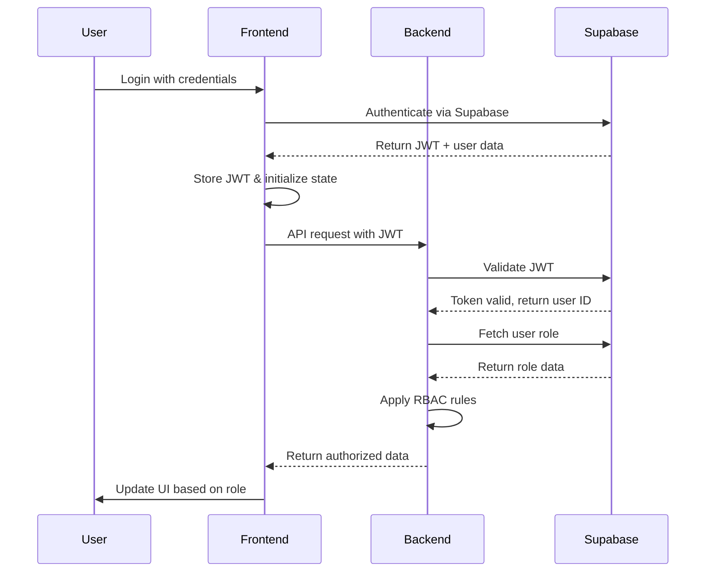

# SecureShop

A full-stack e-commerce application with React frontend, Go backend, and Supabase for authentication and data storage.

## Architecture Overview

```
┌─────────────────┐         ┌─────────────────┐         ┌─────────────────┐
│                 │         │                 │         │                 │
│  React Frontend │ ──JWT─> │   Go Backend    │ ──JWT─> │    Supabase    │
│                 │         │                 │         │                 │
└─────────────────┘         └─────────────────┘         └─────────────────┘
        │                           │                           │
        │                           │                           │
    User Interface          API & Business Logic          Auth & Database
```

### Authentication Flow

1. Frontend (React + Supabase Client):
   - User logs in via Supabase Auth UI
   - Receives JWT token and user data
   - Stores token in memory/local storage
   - Makes authenticated API calls to backend

2. Backend (Go + Gin):
   - Validates Supabase JWT in middleware
   - Extracts user ID from validated token
   - Fetches user role from Supabase DB
   - Enforces role-based access control

3. Database (Supabase):
   - Handles authentication via Supabase Auth
   - Enforces Row Level Security (RLS)
   - Manages user roles and permissions
   - Ensures data access compliance

## Project Structure

```
SecureShop/
├── secure-backend/          # Go backend with Gin
│   ├── handlers/           # API endpoint handlers
│   ├── middleware/         # JWT validation & RBAC
│   ├── models/            # Data structures
│   └── database/          # Supabase client & queries
│
├── secure-frontend/        # React frontend
│   ├── src/
│   │   ├── components/    # Reusable UI components
│   │   ├── pages/        # Route components
│   │   ├── services/     # API & Supabase clients
│   │   └── utils/        # Auth & helper functions
│   └── .env.example      # Environment variables template
│
└── README.md
```

## Quick Start

### Prerequisites

1. Create a Supabase project:
   - Go to [Supabase](https://supabase.com) and create a new project
   - Enable Email/Password authentication
   - Get your project URL and anon key
   - Run the SQL scripts provided in the [Database Setup](#supabase-setup) section

2. Configure environment variables:
   ```bash
   # In secure-backend
   cp .env.example .env
   ```
   ```env
   SUPABASE_URL=your_project_url
   SUPABASE_KEY=your_service_role_key
   JWT_SECRET=your_jwt_secret
   ```

### Backend (Go)

1. Install dependencies:
   ```bash
   cd secure-backend
   go mod download
   ```

2. Run the server:
   ```bash
   go run main.go
   ```
   Server runs on: http://localhost:8080

Key endpoints:
- `POST /api/auth/verify` - Verify JWT and return user data
- `GET /api/products` - Get products (filtered by role)
- `GET /api/users` - Get users (admin only)
- `GET /api/analytics` - Get analytics (admin only)

### Frontend (React)

1. Set up environment variables:
```bash
cd secure-frontend
cp .env.example .env
```
Edit `.env` and add your Supabase credentials:
```env
VITE_SUPABASE_URL=your_supabase_project_url
VITE_SUPABASE_ANON_KEY=your_supabase_anon_key
```

2. Install dependencies and start the development server:
```bash
npm install
npm run dev
```
App runs on: http://localhost:5173

### Supabase Setup

1. Create a new Supabase project
2. Enable Email/Password authentication
3. Create the following tables:

#### Users Table
```sql
create table users (
  id uuid references auth.users on delete cascade,
  email text unique,
  role text check (role in ('admin', 'seller', 'buyer')) default 'buyer',
  created_at timestamp with time zone default timezone('utc'::text, now()) not null,
  primary key (id)
);

-- Set up Row Level Security (RLS)
alter table users enable row level security;

-- Policies
create policy "Users can view their own data" on users
  for select using (auth.uid() = id);

create policy "Admin can view all user data" on users
  for all using (auth.uid() in (
    select id from users where role = 'admin'
  ));
```

#### Products Table
```sql
create table products (
  id uuid default uuid_generate_v4() primary key,
  seller_id uuid references users(id),
  name text not null,
  description text,
  price decimal(10,2) not null,
  stock int not null default 0,
  image text,
  created_at timestamp with time zone default timezone('utc'::text, now()) not null
);

-- Set up Row Level Security (RLS)
alter table products enable row level security;

-- Policies
create policy "Anyone can view products" on products
  for select using (true);

create policy "Sellers can manage their own products" on products
  for all using (
    auth.uid() = seller_id
    or 
    auth.uid() in (select id from users where role = 'admin')
  );
```

#### Orders Table
```sql
create table orders (
  id uuid default uuid_generate_v4() primary key,
  buyer_id uuid references users(id),
  seller_id uuid references users(id),
  product_id uuid references products(id),
  quantity int not null,
  status text check (status in ('pending', 'completed', 'cancelled')) default 'pending',
  created_at timestamp with time zone default timezone('utc'::text, now()) not null
);

-- Set up Row Level Security (RLS)
alter table orders enable row level security;

-- Policies
create policy "Users can view their own orders" on orders
  for select using (
    auth.uid() = buyer_id 
    or 
    auth.uid() = seller_id
    or
    auth.uid() in (select id from users where role = 'admin')
  );

create policy "Buyers can create orders" on orders
  for insert with check (auth.uid() = buyer_id);
```

## Demo Credentials

### Admin User
- Email: `admin@secureshop.com`
- Password: `admin123`
- Role: Admin
- Access: Full system access, user management, analytics

### Seller Account
- Email: `seller@secureshop.com`
- Password: `seller123`
- Role: Seller
- Access: Product management, order processing

### Buyer Account
- Email: `buyer@secureshop.com`
- Password: `buyer123`
- Role: Buyer
- Access: Shopping, orders, reviews

## Features

### Authentication & Authorization
- Supabase Authentication integration
- Role-based access control (RBAC)
- Three user roles: Admin, Seller, and Buyer
- Protected routes and conditional UI rendering

### Role-Specific Features

#### Admin
- User management (view all users, change roles)
- Product management (view/edit all products)
- Analytics dashboard with sales metrics
- Access to all system features

#### Seller
- Manage their own products
- View orders for their products
- Basic analytics for their sales

#### Buyer
- Browse and search products
- Shopping cart functionality
- View order history
- Product reviews and ratings

### Security Architecture

#### Authentication Flow



#### Security Implementation

1. **Frontend Security**:
   ```javascript
   // Auth Context Setup
   const { data, error } = await supabase.auth.signInWithPassword({
     email,
     password
   });

   // Protected API Calls
   const response = await fetch('/api/products', {
     headers: {
       'Authorization': `Bearer ${session.access_token}`
     }
   });
   ```

2. **Backend Middleware (Go)**:
   ```go
   // JWT Validation Middleware
   func AuthMiddleware() gin.HandlerFunc {
     return func(c *gin.Context) {
       token := c.GetHeader("Authorization")
       claims, err := validateSupabaseJWT(token)
       if err != nil {
         c.AbortWithStatus(401)
         return
       }
       
       // Fetch user role from Supabase
       role, err := getUserRole(claims.Subject)
       c.Set("userRole", role)
       c.Next()
     }
   }

   // Role-Based Access Control
   func RequireRole(roles ...string) gin.HandlerFunc {
     return func(c *gin.Context) {
       userRole := c.GetString("userRole")
       if !contains(roles, userRole) {
         c.AbortWithStatus(403)
         return
       }
       c.Next()
     }
   }
   ```

3. **Supabase RLS Policies**:
   ```sql
   -- Example: Products table RLS
   create policy "Sellers manage own products"
   on products for all
   using (
     auth.uid() = seller_id
     or
     exists (
       select 1 from users
       where id = auth.uid()
       and role = 'admin'
     )
   );
   ```

#### Security Features
- JWT-based authentication via Supabase
- Role-based access control (RBAC) in both frontend and backend
- Row Level Security (RLS) in Supabase
- Secure password handling (managed by Supabase Auth)
- CORS protection and request validation
- Protected API endpoints with role checks
- Secure session management
